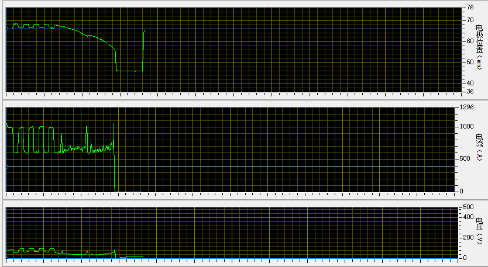
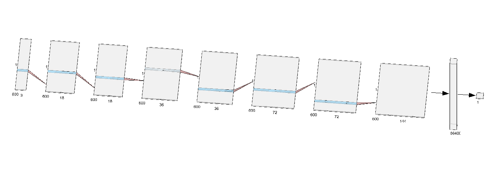

## Convolutional Neural Network For Predicting Welding Quality
- [Chinese](README_CN.md)
### PREREQUISITES
- numpy
- h5py
- git LFS
- tensorflow
- imblearn

### OPTIONAL
- tensorflow-gpu

### Introduction
According to the curve waveform of voltage, current and electrode position, judge the quality of flash welding. The data is multi-dimensional time series. We have 2000 of good quality and 50 of bad quality. In this network, I use data augmentation to increase the number of bad. **Experiments show that CNN is more effective than BP-network and Dropout is effective.** I think convolution can identify the relative positional relationship between multi-dimensional time series, which reduces the over-fitting of the model to some extent. As shown below, the origin data is multi-dimensional time series.

### START
- `git clone git@github.com:wzx140/welding_prediction.git`. This process may be very slow for we also downloading the data for train by `git LFS`
- `conda install --yes --file requirements.txt`. Import dependency to anaconda
- change some variables in *config.py*
- `cd welding_prediction`
- `python main.py train` to train the model and save the model in `log/mode`. There is a trained model in this folder
- `tensorboard --logdir log/tsb`, to see the visualization of the data after training
- `python main.py predict 0 100 path-to-mode`, predict 0~99 data in `dataSets/data.h5` by using the mode save in path-to-mode

### Features

#### Regularization
Implemented Dropout
- set *keep_prob* in *config.py* range from 0~1. 1 means Dropout is disabled

####  DATA AUGMENTATION
Since we only have 50 bad samples, we use ADASYN to expand the bad samples. 

For more information, you can read my blog about [ADASYN](https://masterwangzx.com/2019/04/08/SMOTE/#adasyn)

#### TENSORBOARD
After training, the data for tensorboard will store in `log/tsb`. Just run `tensorboard --logdir log/tsb`

#### DEBUG
If you want to use **tfdbg**, you should,
- install *pyreadline* by pip
- set *enable_debug* True in *config.py*
- run `python main.py train --debug` in project dir
> For more information, you can read [official document](https://www.tensorflow.org/guide/debugger)

## DEMO
- see the [demo](./demo.ipynb)
- we implement more model like [DTW](./other/DTW.ipynb) and [MDS](./other/MDS.ipynb) to classify our data.

## MORE
- CNN model's test accuracy is more than 0.96 and train accuracy is more than 0.99
- the best network architecture is (18 - 36 - 72 - 144)

